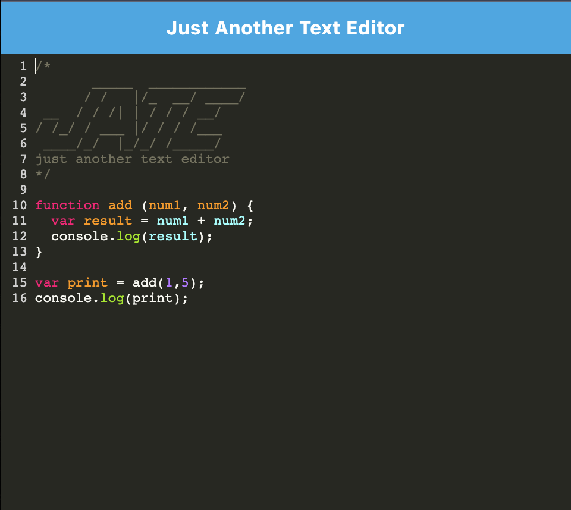

# 19-Progressive-Web-Application

## Table of Contents

[1. Description](#Description)

[2. Installation](#Installation)

[3. Additional Notes](#Additional_Notes)  

## Description

This is the week 19 project "Progressive Web Application" that creates a web based text editor that can be used offline as well. It compiles with Webpack and uses IndexDB to store data when offline.

User Story:

```text
AS A developer
I WANT to create notes or code snippets with or without an internet connection
SO THAT I can reliably retrieve them for later use
```

## Installation

* Clone the repo and the use `run npm install` to intialize the included dependencies
* Run `npm run build` to compile into a bundle
* Run `npm start` to start the app



## Additional Notes

The app can be found live at [https://jons-pwa.herokuapp.com/](https://jons-pwa.herokuapp.com/)